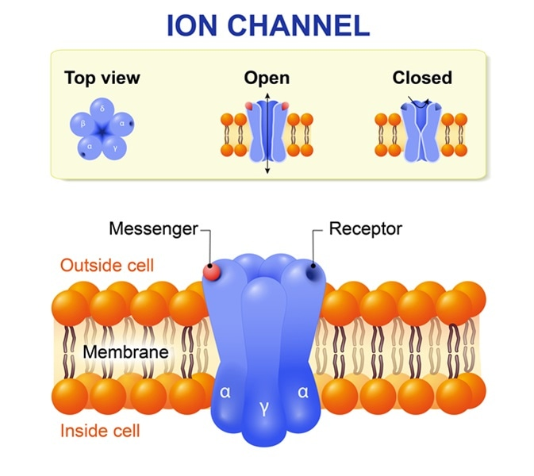
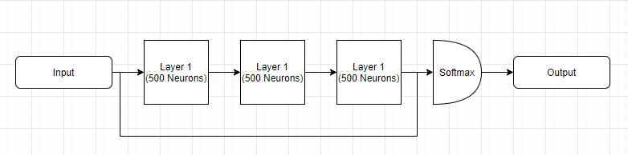

# Ion Challenge - Kaggle

Many diseases, including cancer, are believed to have a contributing factor in common. Ion channels are pore-forming proteins present in animals and plants. They encode learning and memory, help fight infections, enable pain signals, and stimulate muscle contraction. If scientists could better study ion channels, which may be possible with the aid of machine learning, it could have a far-reaching impact.

When ion channels open, they pass electric currents. Existing methods of detecting these state changes are slow and laborious. Humans must supervise the analysis, which imparts considerable bias, in addition to being tedious. These difficulties limit the volume of ion channel current analysis that can be used in research. Scientists hope that technology could enable rapid automatic detection of ion channel current events in raw data.

Technology to analyze electrical data in cells has not changed significantly over the past 20 years. If we better understand ion channel activity, the research could impact many areas related to cell health and migration. From human diseases to how climate change affects plants, faster detection of ion channels could greatly accelerate solutions to major world problems.

### Prerequisites
- Keras
- Tensorflow
- Python 3.7
- Scikit-Learn
- Pandas

### Solution

We developed a simple network but taking the input also as an input of the final layers, this way the netwwork learns both deep patterns and simple rules. It was introduced by Heng-Tze Cheng as a Wide and Deep Neural Network.

### Results
We acheived a F1 Macro score of **0.91** in the public leaderboard